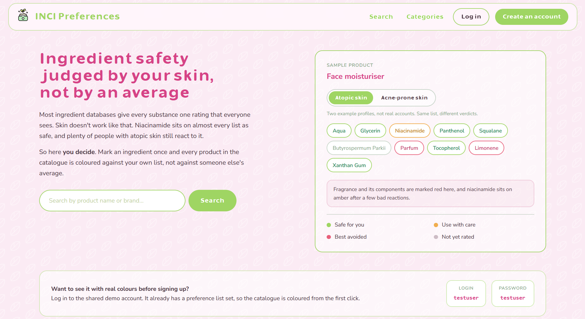
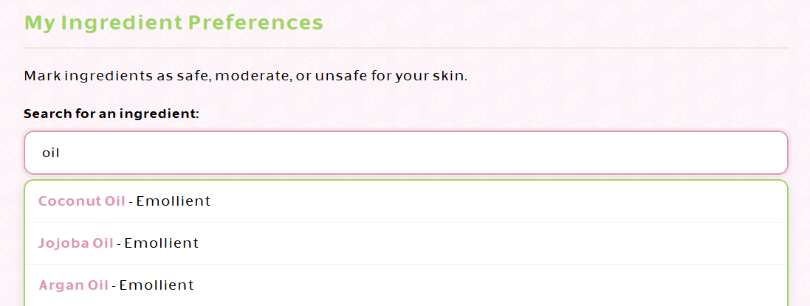

# INCI Preferences — Personalizowany Analizator Składów Kosmetycznych


Aplikacja webowa do personalizowanej analizy składów kosmetyków na podstawie indywidualnych profili preferencji użytkowników: dopasowanie składników, OCR do odczytu zdjęć etykiet, rekomendacje dobrane do konkretnego profilu.

Praca licencjacka, kierunek Informatyka, specjalność technologie sieciowe i bazy danych, Uniwersytet Gdański.

**Live demo:** [incipreferences.app](https://incipreferences.app/)

Zdecydowana większość funkcji (personalizowana klasyfikacja składników, rekomendacje, ulubione,
kolorowanie kosmetyków wg profilu) jest dostępna dopiero po zalogowaniu. Żeby nie trzeba było
zakładać konta, przygotowałyśmy konto pokazowe:

| Login      | Hasło      |
|------------|------------|
| `testuser` | `testuser` |

Konto jest współdzielone: jego nazwa, hasło i istnienie są zablokowane przed zmianą, a preferencje
ustawione przez jednego odwiedzającego zobaczy następny. Do normalnego korzystania z serwisu warto
założyć własne konto.



---

## Problem i motywacja

CosDNA, INCI Beauty, INCI Decoder i podobne serwisy stosują jedną, uniwersalną klasyfikację: każdy składnik dostaje jedną ocenę bezpieczeństwa, niezależnie od tego, kto ją czyta. Problem w tym, że skóra reaguje indywidualnie.

Osoba z atopowym zapaleniem skóry może źle tolerować niacynamid, mimo że jest powszechnie uznawany za bezpieczny. Inna osoba bez problemu stosuje kwas salicylowy, mimo że zwykle oznacza się go jako umiarkowany.

INCI Preferences odpowiada na to inaczej: klasyfikacja składników i rekomendacje są liczone per użytkownik, na podstawie jego własnych preferencji, a nie jednej odgórnej skali.

---

## Architektura systemu

Aplikacja jest podzielona zgodnie z zasadą Single Responsibility Principle na cztery niezależne moduły Django:

```
apps/
├── ingredients/    - zarządzanie składnikami INCI (Ingredient model + REST API)
├── cosmetics/      - zarządzanie kosmetykami, parser, algorytmy dupes (Cosmetic model + ViewSet)
├── preferences/    - profile użytkowników, ulubione, algorytmy rekomendacji (UserProfile model)
└── users/          - autentykacja, rejestracja, reset hasła, zarządzanie kontem
```

Backend eksponuje RESTful API oparte na Django REST Framework: ViewSety, custom actions, middleware do uwierzytelniania sesyjnego.

Frontend to SPA-like aplikacja w vanilla JavaScript: asynchroniczne wywołania `fetch()` do API, dynamiczne renderowanie DOM, komunikacja z backendem przez JSON.

---

## Uruchomienie lokalne

Baza w kontenerze, Django na hoście. Plik `.env.example` jest już pod to skonfigurowany.

```bash
cp .env.example .env          # oczywiście do uzupełnienia
docker compose up -d db
pip install -r requirements-dev.txt
python manage.py migrate
python manage.py import_ingredients
python manage.py runserver
```

Aplikacja wstaje na `http://localhost:8000`.

Przy `DEBUG=True` działają dwa udogodnienia deweloperskie: `django-browser-reload` odświeża kartę
przy każdej zmianie pliku, a wiadomości e-mail (link resetujący hasło) wypisują się w konsoli
serwera zamiast iść przez SMTP.

---

## Funkcjonalności

### System kont użytkowników
- Rejestracja i logowanie oparte o Django Authentication
- Rejestracja wymaga akceptacji Regulaminu i Polityki Prywatności. Zgoda jest polem formularza, więc wszystkie błędy pojawiają się w jednym przejściu, a nie po jednym na zgłoszenie
- Nazwa użytkownika: litery (również z ogonkami), cyfry, `-` i `_`; zajętość sprawdzana bez rozróżniania wielkości liter
- Wymagania hasła odhaczają się na żywo podczas pisania: minimum 8 znaków, mała litera, wielka litera, cyfra. Lista pod polem i walidator po stronie serwera korzystają z tej samej definicji reguł, więc nie mogą się rozjechać
- Podgląd wpisywanego hasła, zachowanie loginu po nieudanej próbie, powrót pod adres z `?next=` po zalogowaniu
- Adres e-mail jest **opcjonalny** i służy wyłącznie do resetu hasła. Konto bez niego działa w pełni, ale zapomnianego hasła nie da się odzyskać
- Reset hasła na wbudowanych widokach Django: link ważny 24 godziny, jednorazowy; dla nieznanego adresu formularz pokazuje ten sam ekran potwierdzenia, żeby nie zdradzać, które konta istnieją
- Po rejestracji użytkownik jest od razu zalogowany i trafia na profil
- Zarządzanie profilem: zmiana nazwy i adresu e-mail, zmiana hasła, usunięcie konta
- Hasła hashowane algorytmem PBKDF2 z SHA256 (domyślny hasher Django)
- Session-based authentication z CSRF Protection
- Ochrona przed brute-force: blokada logowania na 5 minut po 5 nieudanych próbach, licznik trzymany w cache aplikacji

### Personalizowana klasyfikacja składników
- Trójpoziomowa klasyfikacja (bezpieczne / umiarkowane / niebezpieczne) per użytkownik
- Interaktywne ustawianie preferencji: wyszukiwarka składników z autocomplete i przypisaniem koloru
- Automatyczna analiza wzorców: przy minimum 3 ulubionych produktach algorytm wykrywa składniki występujące w co najmniej 50% z nich i proponuje dodanie ich do preferencji




### Wyszukiwarka i zaawansowane filtrowanie
- Wyszukiwanie po fragmencie nazwy kosmetyku i marki (DRF `SearchFilter`)
- Kaskadowe filtrowanie po kategoriach (kategoria → podkategoria → typ produktu)
- Wielokrotne filtry składnikowe (must-contain, must-NOT-contain) z autocomplete
- Sortowanie wg bezpieczeństwa, alfabetycznie, wg marki, wg liczby bezpiecznych składników
- Listy zasobów w API stronicowane (`PageNumberPagination`, 50 pozycji na stronę)


### Dodawanie kosmetyków do katalogu
- Kaskadowe listy kategorii budowane z definicji w modelu, więc formularz nie zaproponuje wartości, której model nie zna
- Licznik rozpoznanych składników aktualizowany podczas wpisywania. Liczy dokładnie tym samym algorytmem co parser po stronie serwera, więc źle sformatowaną listę widać od razu
- Parser dzieli skład na każdym przecinku poza tym stojącym między cyframi: `1,2-Hexanediol` zostaje jedną nazwą, a lista wklejona bez spacji po przecinkach nadal rozbija się poprawnie
- Walidacja przy konkretnych polach i blokada podwójnego wysłania formularza

### Algorytm oceny bezpieczeństwa
Kosmetyki są klasyfikowane w czasie rzeczywistym poprzez porównanie ich składu z profilem użytkownika:

| Kolor       | Warunek                                                                      |
|-------------|------------------------------------------------------------------------------|
| 🟢 Zielony  | Kosmetyk zawiera wyłącznie składniki neutralne lub oznaczone jako bezpieczne |
| 🟡 Żółty    | Kosmetyk zawiera co najmniej jeden składnik oznaczony jako umiarkowany       |
| 🔴 Czerwony | Kosmetyk zawiera co najmniej jeden składnik oznaczony jako niebezpieczny     |

### Algorytmy rekomendacji i wyszukiwania zamienników
- Top-N recommendations: ranking maksymalnie 10 kosmetyków bez składników oznaczonych jako umiarkowane i niebezpieczne, posortowanych wg liczby dopasowanych bezpiecznych składników
- Dupes finder: porównanie zbiorów składników w obrębie tej samej kategorii głównej; miarą jest udział składników oryginału obecnych w produkcie porównywanym, próg 50%, zwracane top 10
- Sortowanie wyników wg similarity score

### Strona produktu
- Werdykt liczony względem listy użytkownika: nagłówek (bezpieczny, do ostrożności, lepiej unikać), liczniki w rozbiciu na oceny i wskazanie z nazwy tych składników, które o werdykcie decydują
- Pełny skład w kolejności z opakowania, każdy składnik z zastosowaniem obok nazwy
- Legenda kolorów mówiąca wprost, że oceny należą do konta i u innej osoby ten sam produkt może wyglądać inaczej
- Niezalogowany widzi ten sam układ w wersji neutralnej, z zaproszeniem do logowania i danymi konta pokazowego

### Okno oceny składnika
Wspólne dla strony produktu i skanera, wstawiane przez `templates/partials/ingredient_modal.html`
wraz z obsługą w `static/js/ingredient-modal.js`:

- Trzy opcje z kropką koloru i krótkim wyjaśnieniem, obecna ocena wyróżniona
- Ponowne kliknięcie w zaznaczoną ocenę zdejmuje ją i składnik wraca do stanu nieocenionego (`color: NONE`)
- Zgłoszenie poprawki zastosowania trafia do kolejki moderacji, API odpowiada kodem 202
- Po zapisie widok przelicza się bez przeładowania strony: na stronie produktu wraca werdykt, w skanerze grupy składników

### Skanowanie składów ze zdjęć (OCR)
Rozpoznawanie tekstu robi Tesseract.js w WebAssembly, więc zdjęcie nie opuszcza przeglądarki.
Na surowym zdjęciu z telefonu sam silnik OCR daje słabe wyniki, dlatego liczy się cała ścieżka:

- Wgranie zdjęcia przez wybór pliku albo przeciągnięcie na pole
- **Kadrowanie**: przeciągnięciem palcem lub myszą zaznacza się sam blok składu, reszta zdjęcia jest pomijana. Nad podglądem stoi instrukcja i linijka stanu mówiąca, czy zaznaczenie zostało zrobione
- **Obróbka przed odczytem**: wycinek skalowany w górę, skala szarości, delikatne odszumienie i próg liczony lokalnie, w oknie wokół piksela. Globalny próg gubi tekst po ciemniejszej stronie opakowania, a progowanie bez odszumienia zamienia ziarno matowej etykiety w czarne kropki. Pomiar na zaszumionym zdjęciu testowym: bez odszumienia zero trafionych nazw z 23, po odszumieniu dwanaście
- **Ustawienia silnika**: tryb jednolitego bloku tekstu, biała lista znaków ograniczona do tych występujących w składach i jawne `user_defined_dpi`, bo kadr z canvasu nie ma metadanych
- **Cięcie listy**: markery początku (`Ingredients`, `INCI`, `Skład`, `Zutaten`, `Composition`) i końca (`Made in`, `Best before`, `www.`, numer partii), sklejanie nazw łamanych myślnikiem na końcu linii, podział po przecinkach z pominięciem tego między cyframi oraz rozbijanie zapisu synonimicznego `AQUA / WATER` do pierwszej nazwy
- **Dopasowanie do katalogu**: jedno zapytanie `POST /api/ingredients/lookup/` dla całej odczytanej listy. Trafienia dokładne uzupełniane są dopasowaniem przybliżonym, które naprawia literówki OCR (`PARKN` do `Parkii`, `ARFUM` do `Parfum`). Próg to ta sama liczba słów i dystans edycyjny najwyżej 1 dla nazw krótszych niż 12 znaków, najwyżej 2 dla dłuższych, więc `Citric Acid` i `Lactic Acid` (dystans 4) zostają osobnymi składnikami. Pozycje dopasowane przybliżeniem mają przerywaną ramkę i podpowiedź z tym, co faktycznie odczytano
- Możliwość poprawienia rozpoznanego tekstu przed analizą
- Wynik w tej samej formie co na stronie produktu: werdykt, liczniki i rozbicie na grupy, przy czym składniki obecne w katalogu można ocenić jednym kliknięciem
- Niepowodzenie odczytu kończy się komunikatem z podpowiedzią, jak zrobić lepsze zdjęcie. Wywołania silnika mają limit czasu, bo zablokowana kompilacja WebAssembly potrafi nie zwrócić ani wyniku, ani błędu


---

## Stack technologiczny

### Backend
| Technologia               | Cel                              |
|---------------------------|----------------------------------|
| **Python 3.12**           | Język programowania              |
| **Django 6.0**            | Framework webowy (MTV)           |
| **Django REST Framework** | RESTful API z ViewSetami         |
| **PostgreSQL 15**         | Relacyjna baza danych            |
| **Gunicorn**              | Production WSGI HTTP Server      |
| **Whitenoise**            | Serwowanie plików statycznych    |
| **django-filter**         | Zaawansowane filtrowanie API     |
| **django-csp**            | Content Security Policy          |
| **psycopg2-binary**       | PostgreSQL adapter               |
| **python-decouple**       | Environment variables management |

### Frontend
| Technologia            | Cel                                                       |
|------------------------|-----------------------------------------------------------|
| **HTML5 / CSS3**       | Struktura i stylowanie (Grid, Flexbox, Custom Properties) |
| **Vanilla JavaScript** | Interakcja z API, dynamiczne renderowanie DOM             |
| **Tesseract.js**       | OCR w przeglądarce (WebAssembly)                          |
| **Fetch API**          | Asynchroniczne wywołania REST API                         |

Arkusze stylów są podzielone wg odpowiedzialności: `style.css` (motyw, nagłówek, stopka i wspólne
karty produktów), `forms.css` (pola formularzy), `auth.css` (ekrany konta), `home.css` (strona
główna), `legal.css` (polityka prywatności i regulamin), `detail.css` (strona produktu),
`scan.css` (skaner), `search.css` i `categories.css` (listy) oraz `ingredient-modal.css`, który
niesie okno oceny składnika współdzielone przez stronę produktu i skaner.

Typografia jest rozdzielona wg roli: KineksRound w nagłówkach, nawigacji i przyciskach, Nunito Sans
w tekście ciągłym i polach formularzy. Oba kroje są hostowane lokalnie, bo CSP dopuszcza w
`font-src` wyłącznie własną domenę. Nunito Sans jest krojem zmiennym, więc jeden plik na podzbiór
znaków (`latin`, `latin-ext`) obsługuje całą skalę grubości.

### Infrastruktura i DevOps
| Technologia        | Cel                                                                       |
|--------------------|---------------------------------------------------------------------------|
| **Docker**         | Konteneryzacja aplikacji: obraz 386 MB, użytkownik non-root, healthcheck. |
| **Railway**        | Platforma hostingowa, region Amsterdam (auto-deploy z GitHub)             |
| **Supabase**       | Managed PostgreSQL z connection poolingiem (port 6543), region Sztokholm  |
| **GitHub Actions** | CI/CD pipeline (testy, security scan, Docker build)                       |
| **Porkbun**        | Rejestracja domeny                                                        |
| **Cloudflare**     | DNS, CDN, SSL, Email Routing                                              |

#### Pliki statyczne

Pliki statyczne serwuje **Whitenoise** bezpośrednio z kontenera aplikacji, za CDN-em Cloudflare.

W kodzie znajduje się przygotowana, ale nieaktywna ścieżka alternatywna: hosting plików statycznych
na Cloudflare R2, włączany zmienną `USE_R2`. Przy `USE_R2=True` `STATIC_URL` wskazuje na publiczny
adres bucketu, a wysyłkę plików wykonuje opcjonalny job `Publish static files to R2`
w GitHub Actions, który jest pomijany, dopóki sekrety R2 nie są skonfigurowane. Wzór zmiennych
w `.env.example`.

### Testowanie i jakość kodu
| Technologia         | Cel                                                        |
|---------------------|------------------------------------------------------------|
| **Django TestCase** | Testy jednostkowe i integracyjne (156 testów w 4 modułach) |
| **DRF APIClient**   | Testy REST API                                             |
| **flake8**          | Linter jakości kodu                                        |
| **bandit**          | Skanowanie bezpieczeństwa kodu                             |
| **safety**          | Skanowanie zależności pod kątem CVE                        |

Zależności produkcyjne są w `requirements.txt`, a narzędzia potrzebne wyłącznie lokalnie
(`django-browser-reload`, `flake8`) w `requirements-dev.txt`. Obraz produkcyjny i CI instalują
tylko ten pierwszy plik.

### Bezpieczeństwo
- Session-based authentication (Django Auth)
- CSRF Protection na wszystkich formularzach i żądaniach stanowych (POST/PUT/PATCH/DELETE)
- Password hashing: PBKDF2 z SHA256 (Django default)
- Walidacja haseł: własny walidator złożoności (długość, mała i wielka litera, cyfra) obok wbudowanych `CommonPasswordValidator` i `UserAttributeSimilarityValidator`
- Ochrona przed otwartym przekierowaniem: parametr `?next=` przechodzi przez `url_has_allowed_host_and_scheme`, więc nie da się nim wyprowadzić zalogowanego użytkownika na obcą domenę
- Strony z danymi użytkownika (`/profile/`, `/favorites/`) chronione dekoratorem `@login_required`
- Konto pokazowe zablokowane przed zmianą nazwy, hasła i usunięciem
- XSS prevention: dane z API trafiają do DOM przez `textContent` i budowane elementy, a tam gdzie szablon składa HTML z tekstu, przechodzi on przez `escapeHtml`
- Content Security Policy (CSP): whitelista ograniczona do własnej domeny i CDN wymaganego przez Tesseract.js. W `script-src` jest `'wasm-unsafe-eval'`, bez którego przeglądarka odmawia kompilacji modułu WebAssembly i skaner zatrzymuje się bez żadnego komunikatu. Strona główna, nawigacja, ekrany konta, formularz dodawania kosmetyku i dokumenty prawne mają kod w osobnych plikach; 17 pozostałych szablonów nadal zawiera osadzone skrypty, więc wyjątek `'unsafe-inline'` jest wciąż potrzebny
- Rate limiting: throttling API (Django REST Framework) oraz blokada logowania po nieudanych próbach
- Kontrola dostępu do katalogu: każdy zalogowany user może dodać nowy kosmetyk/składnik, ale edycja istniejącego wpisu trafia do kolejki moderacji i wymaga akceptacji administratora; usuwanie zarezerwowane wyłącznie dla adminów
- HTTPS wymuszony w produkcji (Let's Encrypt via Cloudflare)
- Environment variables dla wszystkich danych wrażliwych
- Docker non-root user

---

## CI/CD Pipeline

Automatyczny pipeline uruchamiany przy każdym push oraz pull request na branch `main`:

1. **Tests & Linting**: flake8 (błędy krytyczne blokują pipeline, pozostałe ostrzeżenia raportowane) oraz testy Django z bazą PostgreSQL w kontenerze
2. **Security scan**: skanowanie zależności (safety) i kodu (bandit)
3. **Docker build test**: weryfikacja poprawności Dockerfile'a z cache warstw
4. **Publish static files to R2**: opcjonalny, pomijany dopóki sekrety R2 nie są ustawione (patrz „Pliki statyczne")
5. **Deployment status**: potwierdzenie sukcesu, trigger dla Railway auto-deploy

---

## Modele danych

### Kluczowe relacje

  - `User` (Django) 1:1 `UserProfile` (extended profile z preferencjami); adres e-mail jest opcjonalny i używany wyłącznie do resetu hasła
  - `UserProfile` M:N `Ingredient` (safe/moderate/unsafe, trzy niezależne relacje)
  - `UserProfile` M:N `Cosmetic` (favorites)
  - `Cosmetic` M:N `Ingredient` (skład produktu)
  - `Cosmetic`: hierarchiczne kategorie (main_category → subcategory → product_type)
  - `Cosmetic` 1:N `CosmeticEditProposal`, `Ingredient` 1:N `IngredientEditProposal`: kolejka zaproponowanych edycji (status: pending/approved/rejected) czekających na akceptację administratora

-----

## Roadmap i możliwości rozwoju

Zaplanowane kierunki dalszego rozwoju:

  - Wyniesienie pozostałych osadzonych skryptów do plików i zdjęcie wyjątku `'unsafe-inline'` z CSP
  - Mocniejszy odczyt etykiet pisanych krojem odręcznym. Model `eng` Tesseracta jest uczony na drukach i przy takich opakowaniach myli pojedyncze litery na tyle często, że nawet dopasowanie przybliżone nie ratuje listy
  - Integracja z LLM (OpenAI API / Claude API): asystent kosmetyczny odpowiadający na pytania użytkowników
  - Rozszerzone algorytmy rekomendacji: collaborative filtering bazujący na preferencjach podobnych użytkowników
  - Aplikacja mobilna: React Native lub Flutter z natywnym OCR
  - Rozszerzenie bazy składników o dane z EWG Skin Deep i EU CosIng
  - Push notifications: alerty o nowych bezpiecznych produktach spełniających preferencje

-----

## Źródła danych i materiałów

* Katalog składników INCI wraz z zastosowaniami pochodzi z taksonomii
[Open Beauty Facts](https://world.openbeautyfacts.org/), czyli z danych CosIng Komisji Europejskiej,
i jest udostępniany na licencji [ODbL](https://opendatacommons.org/licenses/odbl/). Import robi
komenda `import_inci_taxonomy`.
* Ikonki: [Magnific](https://www.flaticon.com/authors/magnific) na Flaticon.

Oba źródła są podane w stopce serwisu, bo licencja ODbL wymaga wskazania pochodzenia danych,
a Flaticon wskazania autora grafik.

---

## Autorki

  - **Łucja Leśna**: architektura systemu, backend, deployment, testy | [GitHub](https://github.com/lulesna)
  - **Oliwia Natzke**: projekt UI/UX, frontend, koncepcja funkcjonalności | [GitHub](https://github.com/onatzke)

-----

## Licencja

Projekt akademicki. Wszelkie prawa zastrzeżone.
