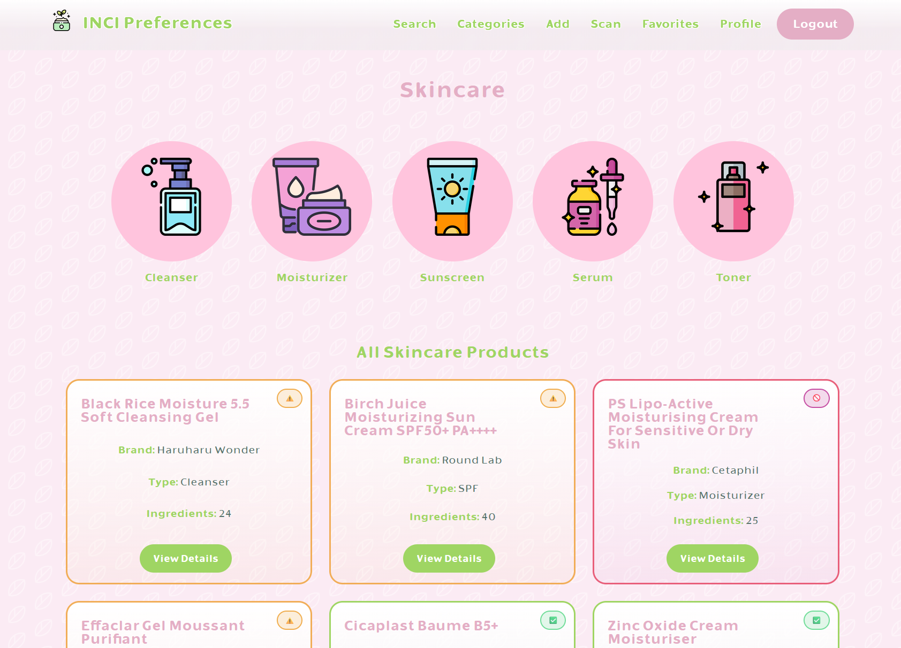
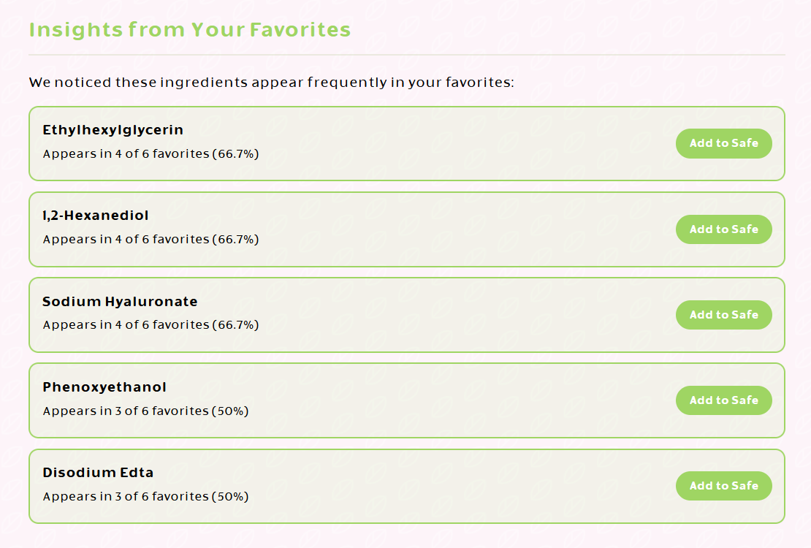
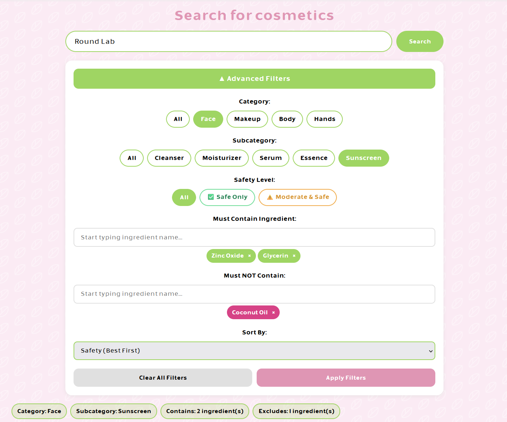

# INCI Preferences — Personalizowany Analizator Składów Kosmetycznych


Aplikacja webowa do personalizowanej analizy składów kosmetyków na podstawie indywidualnych profili preferencji użytkowników: dopasowanie składników, OCR do odczytu zdjęć etykiet, rekomendacje dobrane do konkretnego profilu.

Praca licencjacka, kierunek Informatyka, specjalność technologie sieciowe i bazy danych, Uniwersytet Gdański.

**Live demo:** [incipreferences.app](https://incipreferences.app/)



---

## Problem i motywacja

CosDNA, INCI Beauty, INCI Decoder i podobne serwisy stosują jedną, uniwersalną klasyfikację: każdy składnik dostaje jedną ocenę bezpieczeństwa, niezależnie od tego, kto ją czyta. Problem w tym, że skóra reaguje indywidualnie.

Osoba z atopowym zapaleniem skóry może źle tolerować niacynamid, mimo że jest powszechnie uznawany za bezpieczny. Inna osoba bez problemu stosuje kwas salicylowy, mimo że zwykle oznacza się go jako umiarkowany.

INCI Preferences odpowiada na to inaczej: klasyfikacja składników i rekomendacje są liczone per użytkownik, na podstawie jego własnych preferencji, a nie jednej odgórnej skali.

---

## Architektura systemu

Aplikacja jest podzielona zgodnie z zasadą Single Responsibility Principle na cztery niezależne moduły Django:

```
apps/
├── ingredients/    - zarządzanie składnikami INCI (Ingredient model + REST API)
├── cosmetics/      - zarządzanie kosmetykami, parser, algorytmy dupes (Cosmetic model + ViewSet)
├── preferences/    - profile użytkowników, ulubione, algorytmy rekomendacji (UserProfile model)
└── users/          - autentykacja, rejestracja, zarządzanie kontem
```

Backend eksponuje RESTful API oparte na Django REST Framework: ViewSety, custom actions, middleware do uwierzytelniania sesyjnego.

Frontend to SPA-like aplikacja w vanilla JavaScript: asynchroniczne wywołania `fetch()` do API, dynamiczne renderowanie DOM, komunikacja z backendem przez JSON.

---

## Funkcjonalności

### System kont użytkowników
- Rejestracja i logowanie oparte o Django Authentication
- Rejestracja wymaga akceptacji Regulaminu i Polityki Prywatności
- Zarządzanie profilem: zmiana loginu, zmiana hasła z walidacją (PBKDF2 + SHA256), usuwanie konta
- Session-based authentication z CSRF Protection
- Ochrona przed brute-force: blokada logowania na 5 minut po 5 nieudanych próbach z danego IP

### Personalizowana klasyfikacja składników
- Trójpoziomowa klasyfikacja (bezpieczne / umiarkowane / niebezpieczne) per użytkownik
- Interaktywne ustawianie preferencji przez kliknięcie w składnik
- Automatyczna analiza wzorców: algorytm wykrywa składniki występujące w co najmniej 50% ulubionych produktów i proponuje dodanie ich do preferencji



### Wyszukiwarka i zaawansowane filtrowanie
- Full-text search po nazwie kosmetyku i marce (Django `SearchFilter`)
- Kaskadowe filtrowanie po kategoriach (kategoria → podkategoria → typ produktu)
- Wielokrotne filtry składnikowe (must-contain, must-NOT-contain) z autocomplete
- Sortowanie wg bezpieczeństwa, alfabetycznie, wg liczby bezpiecznych składników
- Wyniki API stronicowane (`PageNumberPagination`, 50 pozycji na stronę)



### Algorytm oceny bezpieczeństwa
Kosmetyki są klasyfikowane w czasie rzeczywistym poprzez porównanie ich składu z profilem użytkownika:

| Kolor | Warunek |
|-------|---------|
| 🟢 Zielony | Kosmetyk zawiera wyłącznie składniki neutralne lub oznaczone jako bezpieczne |
| 🟡 Żółty | Kosmetyk zawiera co najmniej jeden składnik oznaczony jako umiarkowany |
| 🔴 Czerwony | Kosmetyk zawiera co najmniej jeden składnik oznaczony jako niebezpieczny |

### Algorytmy rekomendacji i wyszukiwania zamienników
- Top-N recommendations: ranking bezpiecznych kosmetyków posortowanych wg liczby dopasowanych bezpiecznych składników
- Dupes finder: porównanie oparte na współczynniku Jaccarda (podobieństwo zbiorów), threshold 40%
- Sortowanie wyników wg similarity score

### Skanowanie składów ze zdjęć (OCR)
- Upload zdjęcia z drag & drop lub file picker
- Rozpoznawanie tekstu przez Tesseract.js (WebAssembly, on-device)
- Automatyczne czyszczenie i parsowanie tekstu (usuwanie markerów `Ingredients:`, `INCI:`, normalizacja białych znaków)
- Możliwość edycji rozpoznanego tekstu przed analizą
- Pełna analiza bezpieczeństwa z podziałem na kategorie

---

## Stack technologiczny

### Backend
| Technologia | Cel |
|------------|-----|
| **Python 3.12** | Język programowania |
| **Django 6.0** | Framework webowy (MTV) |
| **Django REST Framework** | RESTful API z ViewSetami |
| **PostgreSQL 15** | Relacyjna baza danych |
| **Gunicorn** | Production WSGI HTTP Server |
| **Whitenoise** | Serwowanie plików statycznych |
| **django-filter** | Zaawansowane filtrowanie API |
| **django-csp** | Content Security Policy |
| **psycopg2** | PostgreSQL adapter |
| **python-decouple** | Environment variables management |

### Frontend
| Technologia | Cel |
|------------|-----|
| **HTML5 / CSS3** | Struktura i stylowanie (Grid, Flexbox, Custom Properties) |
| **Vanilla JavaScript** | Interakcja z API, dynamiczne renderowanie DOM |
| **Tesseract.js** | OCR w przeglądarce (WebAssembly) |
| **Fetch API** | Asynchroniczne wywołania REST API |

### Infrastruktura i DevOps
| Technologia | Cel |
|------------|-----|
| **Docker** | Konteneryzacja aplikacji (multi-stage build, non-root user, healthcheck) |
| **Railway** | Platforma hostingowa (auto-deploy z GitHub) |
| **Supabase** | Managed PostgreSQL z connection poolingiem (port 6543) |
| **GitHub Actions** | CI/CD pipeline (testy, security scan, Docker build) |
| **Porkbun** | Rejestracja domeny + DNS management |
| **Cloudflare** | DNS, CDN, SSL |
| **Cloudflare R2** | Hosting plików statycznych (CSS, JS, fonty, obrazy) |

#### Pliki statyczne na Cloudflare R2

Włączane zmienną `USE_R2`. Przy `USE_R2=False` pliki serwuje whitenoise z kontenera. Przy `USE_R2=True` `STATIC_URL` wskazuje na publiczny
adres bucketu, a `` generuje adresy R2.

Wysyłkę plików robi job `Publish static files to R2` w GitHub Actions, po przejściu
testów, na push do `main`. Dzięki temu klucze zapisu do R2 żyją wyłącznie jako
GitHub Secrets.

Zmienne środowiskowe aplikacji na Railway: `USE_R2=True` oraz `R2_PUBLIC_URL`.
GitHub Secrets: `R2_PUBLIC_URL`, `R2_ACCOUNT_ID`, `R2_BUCKET_NAME`,
`R2_ACCESS_KEY_ID`, `R2_SECRET_ACCESS_KEY`. Wzór w `.env.example`.

### Testowanie i jakość kodu
| Technologia | Cel |
|------------|-----|
| **Django TestCase** | Testy jednostkowe i integracyjne |
| **DRF APIClient** | Testy REST API |
| **coverage.py** | Pomiar pokrycia kodu testami |
| **flake8** | Linter jakości kodu |
| **bandit** | Skanowanie bezpieczeństwa kodu |
| **safety** | Skanowanie zależności pod kątem CVE |

### Bezpieczeństwo
- Session-based authentication (Django Auth)
- CSRF Protection na wszystkich formularzach i żądaniach stanowych (POST/PUT/PATCH/DELETE)
- Password hashing: PBKDF2 z SHA256 (Django default)
- XSS prevention: HTML escaping w JavaScript, textContent zamiast innerHTML dla user-supplied data
- Content Security Policy (CSP): whitelista ograniczona do własnej domeny i CDN wymaganego przez Tesseract.js
- Rate limiting: throttling API (Django REST Framework) oraz blokada logowania po nieudanych próbach
- Kontrola dostępu do katalogu: każdy zalogowany user może dodać nowy kosmetyk/składnik, ale edycja istniejącego wpisu trafia do kolejki moderacji i wymaga akceptacji administratora; usuwanie zarezerwowane wyłącznie dla adminów
- HTTPS wymuszony w produkcji (Let's Encrypt via Cloudflare)
- Environment variables dla wszystkich danych wrażliwych
- Docker non-root user, minimal image size (--no-install-recommends)

---

## CI/CD Pipeline

Automatyczny pipeline uruchamiany przy każdym push oraz pull request na branch `main`:

1. **Test job**: uruchomienie testów Django z bazą PostgreSQL w kontenerze
2. **Security scan**: skanowanie zależności (safety) i kodu (bandit)
3. **Docker build test**: weryfikacja poprawności Dockerfile'a z cache warstw
4. **Deployment notification**: potwierdzenie sukcesu, trigger dla Railway auto-deploy

---

## Modele danych

### Kluczowe relacje

  - `User` (Django) 1:1 `UserProfile` (extended profile z preferencjami)
  - `UserProfile` M:N `Ingredient` (safe/moderate/unsafe, trzy niezależne relacje)
  - `UserProfile` M:N `Cosmetic` (favorites)
  - `Cosmetic` M:N `Ingredient` (skład produktu)
  - `Cosmetic`: hierarchiczne kategorie (main_category → subcategory → product_type)
  - `Cosmetic` 1:N `CosmeticEditProposal`, `Ingredient` 1:N `IngredientEditProposal`: kolejka zaproponowanych edycji (status: pending/approved/rejected) czekających na akceptację administratora

-----

## Roadmap i możliwości rozwoju

Zaplanowane kierunki dalszego rozwoju:

  - Integracja z LLM (OpenAI API / Claude API): asystent kosmetyczny odpowiadający na pytania użytkowników
  - Rozszerzone algorytmy rekomendacji: collaborative filtering bazujący na preferencjach podobnych użytkowników
  - Aplikacja mobilna: React Native lub Flutter z natywnym OCR
  - Rozszerzenie bazy składników o dane z EWG Skin Deep i EU CosIng
  - Push notifications: alerty o nowych bezpiecznych produktach spełniających preferencje

-----

## Autorki

  - **Łucja Leśna**: architektura systemu, backend, deployment, testy | [GitHub](https://github.com/lulesna)
  - **Oliwia Natzke**: projekt UI/UX, frontend, koncepcja funkcjonalności | [GitHub](https://github.com/onatzke)

-----

## Licencja

Projekt akademicki. Wszelkie prawa zastrzeżone.
